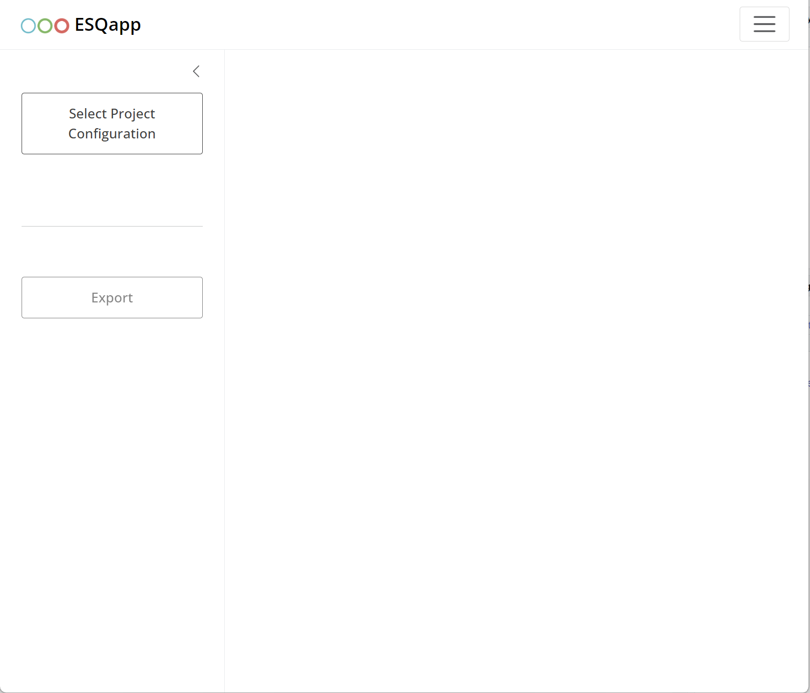

# Getting started

## Introduction

[ESQapp](https://github.com/esqLABS/ESQapp) is a graphical user
interface (GUI) for working with the projects implemented in the
[`{esqlabsR}`](https://github.com/esqLABS/esqlabsR) package.

## Opening the project

[ESQapp](https://github.com/esqLABS/ESQapp) operates with the projects
by loading a valid [`ProjectConfiguration`
file](https://esqlabs.github.io/esqlabsR/articles/esqlabsR-project-structure.html).
In this example, we will use an example project created by executing

``` r
library(esqlabsR)

init_project()
```

Start the app by calling

``` r
ESQapp::run_app()
```



starting screen

Click on “Select Project Configuration” and select the
`ProjectConfiguration.xlsx` file of your project. The app will load the
project and show the contents of the scenario definitions, individuals,
populations, and plots.


import project configuration

## Design Scenarios

You can browse, edit, add new, or remove existing scenarios. To edit a
field, e.g., `Scenario_name`, double-click on it. To remove a scenario
or add a new one, right-click on a row and select “Insert” or “Remove
row”.

 Scenarios with
duplicate names are highlighted in red, as each  
`Scenario_name` must be unique.


unique scenario

The main properties that can be defined for a scenario are:

- The `IndividualId` column specifies the individual for a scenario.  
  This column shows a drop-down list with all individuals defined in the
  **Individuals** tab. To unassign an individual from a scenario:

  - Right-click on the cell and select **Clear**,
  - Press the **Backspace** key on your keyboard, or
  - Select `--NONE--` option in the drop-down list.

- The population is specified for a scenario in the column
  `PopulationId`, which shows a drop-down list with all populations
  defined in the **Populations** tab. To unassign a population from a
  scenario:

  - Right-click on the cell and select **Clear**,
  - Press the **Backspace** key on your keyboard, or
  - Select `--NONE--` option in the drop-down list.

- To edit the **simulation time** of a scenario, double-click on the  
  `SimulationTime` cell. This will open a modal window where you can  
  configure the output intervals of the simulation.    
  In this window, you can add, remove, or edit intervals. For each  
  interval, you can define the start and end time, the unit, and the  
  resolution.  
    
  Since the original Excel structure does not allow mixing different
  time  
  units within the output interval definition, all values are  
  automatically converted to a **target unit**. The target unit is
  taken  
  from the first unit cell of the table and is stored in the read-only  
  column `SimulationTimeUnit`.

- **Parameter sets** are defined in the `Parameter sets` column.  
  When you double-click on a cell in this column, a list of parameter
  sets  
  (from the **Parameter sets** tab) is displayed. You can then select
  the  
  desired parameters and arrange their order to include them in the
  scenario. 

- The applications is specified for a scenario in the column
  `ApplicationProtocol`, which shows a drop-down list with all
  applications defined in the **Applications** tab. To unassign a
  application protocol from a scenario:

  - Right-click on the cell and select **Clear**,
  - Press the **Backspace** key on your keyboard, or
  - Select `--NONE--` option in the drop-down list.

- Output paths are defined in the column `OutputPathsIds`. When
  double-clicking on a cell, a list of output paths defined in the
  `OutputPaths` tab is presented and the user can select the paths that
  should be added to the scenario.  
  

### Individuals

The individuals assigned to the scenarios must be specified in the
`Individuals` tab. To add a new invidividual, right-click on an existing
entry and select “Isert row below”. After entering the name of the
individual, a new individual parameters sheet is added.


To **map a protein to ontogeny**, define a new protein–ontogeny  
relationship, or edit an existing one, double-click the  
`Protein Ontogenies` cell. This will open a modal window for managing  
the mapping.


protein-ontogenies

### Populations

Populations are defined in the `Populations` tab. To **map a protein to
ontogeny**, define a new protein–ontogeny  
relationship, or edit an existing one, double-click the  
`Protein Ontogenies` cell. This will open a modal window for managing  
the mapping.

### Parameter sets

Parameter sets specified in the column `Parameter sets` of the
`Scenarios` tab are listed in the tab `Parameter sets`.


parameter sets

To add new entries, right-click on a row and select “Insert row” or
“Remove row”. To add a new parameter set (excel sheet), click on “Add
parameter set”.

### Applications

Application specified in the column `ApplicationProtocol` of the
`Scenarios` tab are listed in the tab `Applications`.

To add new entries, right-click on a row and select “Insert row” or
“Remove row”. To add a new parameter set (excel sheet), click on “Add
parameter set”.


applications

## Plot Results

Definition of the figures within the
[esqlabsR](https://github.com/esqLABS/esqlabsR) [Plotting
Workflow](#plotting-workflow) is supported by the
[ESQapp](https://github.com/esqLABS/ESQapp) in the tab `Plots`.


plots

The **DataCombined** tab defines the mappings between simulation
results  
and observer data. In this tab, the app allows you to select scenarios  
(from the **Scenarios** tab) and output paths (from the  
`Scenarios|OutputPaths` list).

To load observed data, click the **Load Observed Data** button. This  
opens a modal window displaying the available observed sheet(s). You
can  
select the sheet(s) to load by marking the corresponding checkboxes.


plots-load-observed-data

Once loaded, the names of the observed sheets become available as a
list  
in the drop-down of the `dataSet` column. By right-clicking on a cell
in  
the `dataSet` column, you can access a context menu with the option  
**Show metadata**.


Selecting this option opens a modal window with a  
metadata table. This table is read-only and available only for  
previously loaded observed data.


plots-load-observed-metadata

## Applying the changes

`WARNING:` Closing the app without saving will loose all changes made to
the configurations!

After editing the scenarios, plots, or other configurations, the changes
must be saved by clicking on the “Export” button.


export

The changes will be written into the Excel files. Of course, you can
still manually edit the Excel files.
