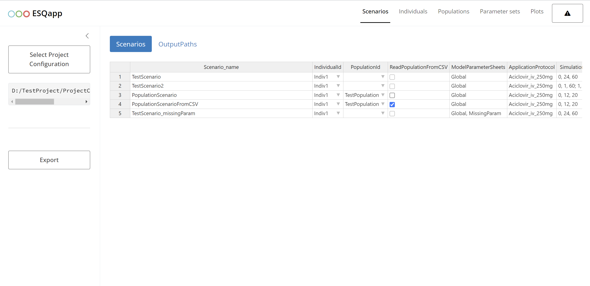

# ESQapp

ESQapp is a GUI for the [esqlabsR](https://github.com/esqLABS/esqlabsR)
package. It allows users to create, edit, and run scenarios for the Open
Systems Pharmacology Suite. See [Getting
started](https://esqlabs.github.io/ESQapp/articles/getting-started.html)
to learn how to use the app.



## Installation

Install pak:

``` r
install.packages("pak")
```

You can install the package by running:

``` r
pak::pak("esqLABS/ESQapp@*release")
```

Get the latest development version with:

``` r
pak::pak("esqLABS/ESQapp")
```

## Usage

Start the app by calling

``` r
ESQapp::run_app()
```

Get started and learn how to use the {ESQapp} in
[`vignette("getting-started")`](https://esqlabs.github.io/ESQapp/articles/getting-started.md)

## Development

To run the package locally:

1.  Clone the repository from GitHub

``` R
https://github.com/esqLABS/ESQapp.git
```

2.  Open the project in RStudio

3.  Install the dependencies

``` r
renv::restore(lockfile = 'renv.lock')
```

4.  Run the app

``` r
source("dev/run_dev.R")
```

5.  Make changes to the code
6.  Snapshot the changes

``` r
renv::install("package_name")
source("dev/get_snapshot.R")
golem::add_to_description("package_name")
golem::document_and_reload()
```

Note: For changes related to the table interface, `ESQapp` depends on
[`esqlabs.handsontable`](https://github.com/esqLABS/esqlabs.handsontable).

## Code of Conduct

Please note that the ESQapp project is released with a [Contributor Code
of
Conduct](https://contributor-covenant.org/version/2/0/CODE_OF_CONDUCT.html).
By contributing to this project, you agree to abide by its terms.
