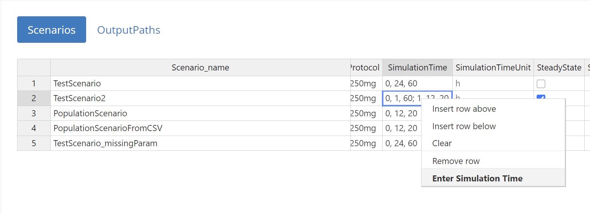
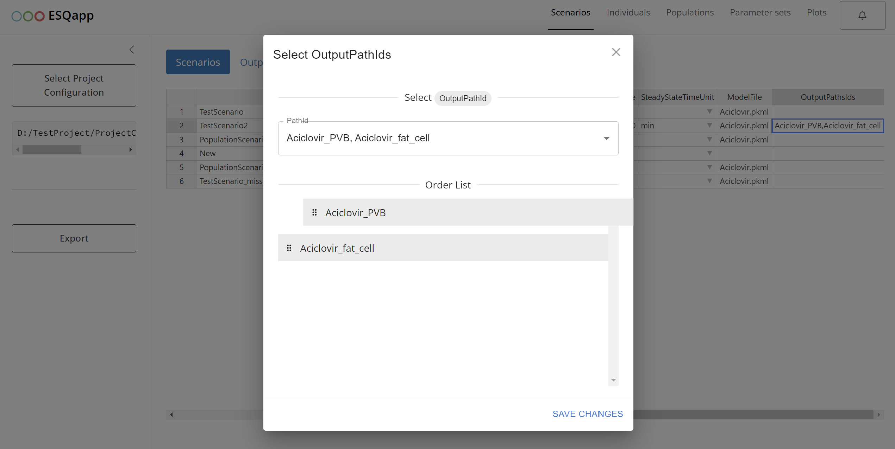
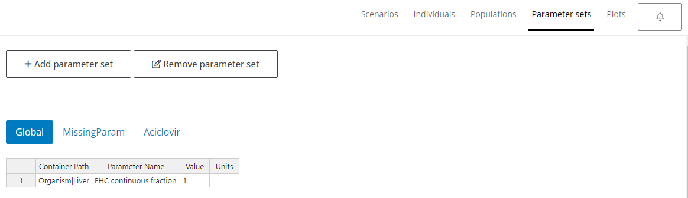

```{r, include = FALSE}
knitr::opts_chunk$set(
  collapse = TRUE,
  comment = "#>",
  warning = FALSE,
  message = FALSE,
  fig.showtext = TRUE
)
```

## Introduction

`{ESQapp}` is a graphical user interface (GUI) for working with the
projects implemented in the
[`{esqlabsR}`](https://github.com/esqLABS/esqlabsR) package.

## Opening the project

`{ESQapp}` operates with the projects by loading a valid
[`ProjectConfiguration`
file](https://esqlabs.github.io/esqlabsR/articles/esqlabsR-project-structure.html).
In this example, we will use an example project created by executing

```{r create-new-project, eval=FALSE}
library(esqlabsR)

init_project()
```

Start the app by calling

```{r, eval=FALSE}
ESQapp::run_app()
```


Click on "Select Project Configuration" and select the
`ProjectConfiguration.xlsx` file of your project. The app will load the
project and show the contents of the scenario definitions, individuals,
populations, and plots.


## Design Scenarios

You can browse, edit, add new, or remove existing scenarios. To edit a
field, e.g., `Scenario_name`, double-click on it. To remove a scenario
or add a new one, right-click on a row and select "Insert" or "Remove
row".


The main properties that can be defined for a scenario are:

-   The `IndividualId` column specifies the individual for a scenario.
    This column shows a drop-down list with all individuals defined in
    the Individuals tab. To unassign an individual from a scenario,
    right-click on the cell and select "Clear".

-   The population is specified for a scenario in the column
    PopulationId, which shows a drop-down list with all populations
    defined in the `Populations` tab. To unassign a population from a
    scenario, right-click on the cell and select "Clear".

-   To edit the **simulation time** of the scenario, right click on the
    `SimulationTime` entry and select "Enter Simulation Time".\
    \
    In the following window, you can edit the output intervals of the
    simulation.\
    \
    To add or remove an interval, right click on an existing row. You
    can define the start and the end time of the interval, define the
    units, and define the resolution. As the original excel structure do
    not allow to mix time units for otput intervals definition, all
    values must be converted to a common unit. This is done
    automatically to the unit selected by the user, the unit is stored
    in the read-only column `SimulationTimeUnit`.

-   Output paths are defined in the column `OutputPathsIds`. When
    double-clicking on a cell, a list of output paths defined in the
    `OutputPaths` tab is presented and the user can select the paths
    that should be added to the scenario.\
    

### Individuals

The individuals assigned to the scenarios must be specified in the
`Individuals` tab. To add a new invidividual, right-click on an existing
entry and select "Isert row below". After entering the name of the
individual, a new individual parameters sheet is added.


Currently, definition of protein ontogenies are currently not supported
in the App.

### Populations

Populations are defined in the `Populations` tab. Definition of protein
ontogenies are currently not supported in the App and must be done in
the excel file.

### Parameter sets

Parameter sets specified in the column `ModelParameterSheets` of the
`Scenarios` tab are listed in the tab `Parameter sets`.



To add new entries, right-click on a row and select "Insert row" or
"Remove row". To add a new parameter set (excel sheet), click on "Add
parameter set".

### Applications

Definition of application protocols is not supported yet and must be
performed in the excel file.

## Plot Results

Definition of the figures within the `{esqlabsR}` [Plotting
Workflow](#plotting-workflow) is supported by the `{ESQapp}` in the tab
`Plots`.


The `DataCombined` defining the mappings of simulation results with
observer data are specified in the `DataCombined` tab. The app allows
selecting the scenarios defined in the `Scenarios` tab, and output paths
from the `Scenarios|OutputPaths` list.

## Applying the changes

`WARNING:` Closing the app without saving will loose all changes made to
the configurations!

After editing the scenarios, plots, or other configurations, the changes
must be saved by clicking on the "Export" button.


The changes will be written into the Excel files. Of course, you can
still manually edit the Excel files.
